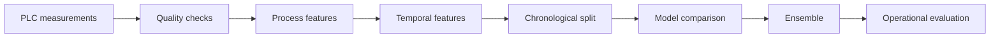

# Industrial Defect Prediction


[](https://github.com/zakilbaki/Defect-Prediction-on-production-lines/actions/workflows/ci.yml)

An end-to-end industrial machine-learning project for detecting defective
starter-motor products before end-of-line quality control.

The dataset combines measurements collected across assembly stations, including
torque, angle, force, current, and voltage. The central challenge is not raw model
accuracy. It is learning from fewer than 1% defective products without leaking future
production information into training.

## Business objective

Late defect detection increases rework, scrap, and test-bench load. The model ranks
products by defect risk using process measurements available earlier on the line, so
high-risk units can be inspected sooner.

## Complete analysis

The entire analytical workflow, including saved charts and model outputs, is available
in one notebook:

**[Open the complete analysis](notebooks/industrial_defect_prediction.ipynb)**

It covers:

- data integrity, missing measurements, class imbalance, and IQR outliers;
- correlations, PCA, 2D and 3D projections, t-SNE, and KS-based feature ranking;
- process features based on torque, angle, force, energy, and electrical power;
- lag, delta, and rolling z-score features for production drift;
- Logistic Regression, Elastic Net, One-Class SVM, XGBoost, Autoencoder, and MLP;
- soft-voting and hard-voting ensembles;
- AUROC, Average Precision, recall, precision, confusion matrices, and false alarms.

## Method



Important methodological choices:

- production order is preserved during validation;
- imputation and scaling are fitted after splitting;
- temporal statistics use earlier products only;
- AUROC is paired with Average Precision because the target is extremely imbalanced;
- operational results report detected defects and false alarms, not accuracy alone.

## Recorded results

The committed notebook retains the outputs produced during the experiments:

| Evaluation stage | AUROC | Average Precision |
| --- | ---: | ---: |
| Best validation ensemble | 0.6991 | 0.0374 |
| Validation after PCA post-processing | 0.7176 | 0.0397 |
| Final chronological test | 0.6979 | 0.0155 |

These results should be interpreted with the validation protocol and class prevalence
shown in the notebook. The reusable baseline keeps a stricter past-only feature
pipeline for repeatable evaluation on a local copy of the challenge data.

## Reusable pipeline

Requirements: Python 3.11+ and the three challenge CSV files.

```bash
python -m venv .venv
source .venv/bin/activate
pip install -r requirements.txt
```

Place the files under `data/`, then run:

```bash
PYTHONPATH=src python -m industrial_defect_prediction.train \
  --training-inputs data/traininginputs.csv \
  --training-output data/trainingoutput.csv
```

The command saves:

```text
artifacts/model.joblib
artifacts/metrics.json
```

## Repository structure

```text
notebooks/industrial_defect_prediction.ipynb  complete analysis with outputs
src/industrial_defect_prediction/             reusable feature and model pipeline
tests/                                        leakage and chronology checks
data/README.md                                dataset setup
artifacts/                                    generated locally and ignored by Git
```

## Quality checks

```bash
pip install -r requirements-dev.txt
ruff check --select E9,F63,F7,F82 src tests
pytest -q
```

GitHub Actions runs the source checks and unit tests on every pull request.
