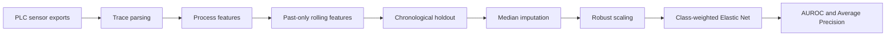

# Industrial Defect Prediction

[](https://github.com/zakilbaki/industrial-defect-prediction/actions/workflows/ci.yml)

Leakage-aware machine-learning baseline for detecting defective starter-motor products
before end-of-line quality control.

The project uses assembly-station measurements such as torque, angle, force, current,
and voltage. Its engineering focus is the part that matters most in industrial ML:
extreme class imbalance, production-order validation, missing measurements, and
traceable feature construction.

## Business problem

Late defect detection creates scrap, rework, and avoidable test-bench load. The target
is to rank products by defect risk using measurements available earlier on the line so
that suspicious units can be inspected sooner.

## Dataset

The public [Valeo Challenge Data #36](https://challengedata.ens.fr/challenges/36)
contains 34,515 labeled training products and 8,001 test products. Only about 0.9% of
training rows are defective, so accuracy is not informative; this project reports
AUROC and Average Precision.

The raw files require challenge registration and are intentionally not committed.
Instructions are available in `data/README.md`.

## Method



Key design choices:

- split by production date and sequence, never by random shuffling;
- compute rolling statistics from earlier products with `shift(1)`;
- preserve missingness as a signal while imputing model inputs;
- use a sparse, interpretable linear baseline with class balancing;
- save the fitted pipeline, feature order, and metrics together.

## Results and metric integrity

The exploratory notebook recorded a best AUROC of `0.725` and Average Precision of
`0.0258`, above the challenge's stated `0.675` AUROC benchmark. That score is retained
as an exploratory result, not presented as the final reproducible score: the notebook
selected features using the same holdout and later sorted rolling features by sequence
without the full date.

The production CLI fixes both issues and writes fresh metrics to
`artifacts/metrics.json`. This distinction is intentional: a conservative metric with
a defensible validation protocol is more useful than an optimistic leaked score.

## Run the pipeline

Requirements: Python 3.11+ and the two challenge training files.

```bash
python -m venv .venv
source .venv/bin/activate
pip install -r requirements.txt
```

```bash
PYTHONPATH=src python -m industrial_defect_prediction.train \
  --training-inputs data/traininginputs.csv \
  --training-output data/trainingoutput.csv
```

Generated artifacts:

```text
artifacts/model.joblib
artifacts/metrics.json
```

## Repository structure

```text
src/industrial_defect_prediction/  reusable features, modeling, and training CLI
notebooks/01_exploration.ipynb      original EDA and model experiments
tests/                              leakage and chronology regression tests
data/README.md                      dataset acquisition and expected filenames
artifacts/                          local models and reports, excluded from Git
```

## Quality checks

```bash
pip install -r requirements-dev.txt
ruff check --select E9,F63,F7,F82 src tests
pytest -q
```

GitHub Actions runs these checks on every pull request without requiring the private
local copy of the challenge data.


